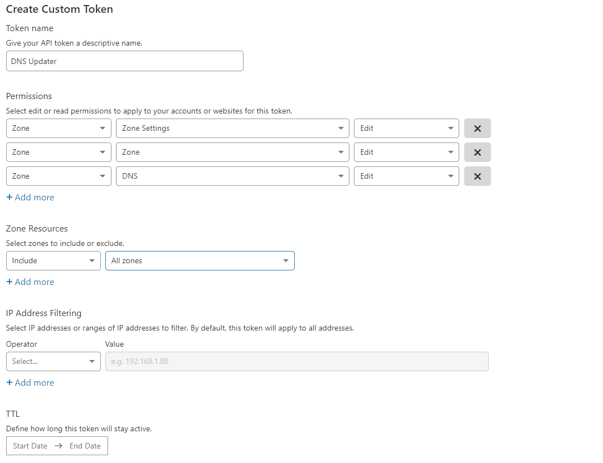

If you have a dynamic IP for your network you will know that every time your IP changes your services will no longer work which can cause a lot of downtime which to solve you will need to go into Cloudflare and update your host entry to point to your new IP. I have recently set up a service on my swarm that does this automatically for me, In this post, I will show you how to set the service up yourself


### Creating cloudflare.yml

This service is useful if you are using a dynamic IP which is common if you are running the swarm on a homelab. Any time your IP changes, you will need to update IP address in your DNS records.

This image will make sure that the host IP address for your domain is always current. When your Host IP changes, it will automatically update your DNS records.


```
version: "3.8"
  cf-ddns:
    image: oznu/cloudflare-ddns:latest
    restart: always
    environment:
      - API_KEY=apikey
      # The master domain
      - ZONE=domain.com
      - PROXIED=true
      # The subdomain of the site
      - SUBDOMAIN=subdomain
      - RRTYPE=A
      # We do not want the record to be deleted when the service stops
      - DELETE_ON_STOP=false
      # Cloudflares DNS Server
      - DNS_SERVER=1.1.1.1
```


API_Key: This will be the API key that we will create in the next step

Zone: The domain you use for traefik

SUBDOMAIN: The subdomain which traefik is on, EG traefik.example.com

DELETE_ON_STOP: Keep false because we do not want the record to be deleted

DNS_SERVER: Keep as 1.1.1.1 as this is Cloudflare's DNS server


### Creating an API Key


First, we will need to get an API key so the service has the correct permissions to update your domain on Cloudflare.


You can create an API key by going to your Cloudflare [Profile](https://dash.cloudflare.com/profile/) and clicking on [API Tokens](https://dash.cloudflare.com/profile/api-tokens). When you click create token it will ask if you wish to use a template or use a custom token, click on custom token

First, you will need to give the token a name, and then you will need to select 3 permissions and give them each edit access

1. Zone.Zone
2. Zone.DNS
3. Zone.Settings


You can either give the token access to all zones or just the zone you have your stack on. In this guide, I selected all zones.


This is what it should look like after you have completed




Once you have saved you will be given an API key which you can enter into traefikv2.yml


### Deploying cloudflare.yml

You can now deploy the service by running `docker swarm deploy cloudflare -c /path/to/cloudflare.yml`